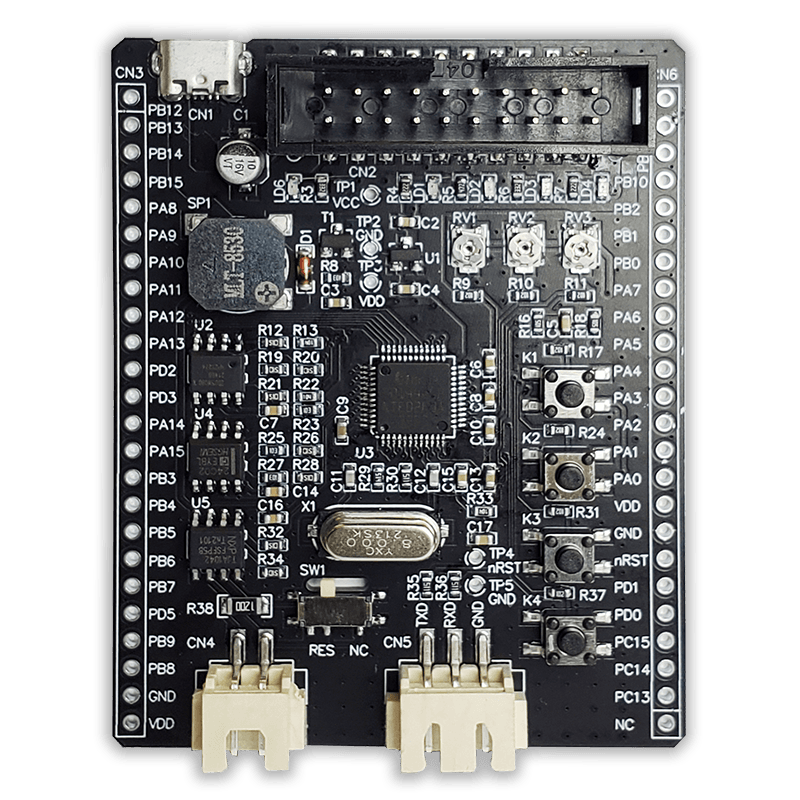

# MINI-F0144 Board

MindMotion **MM32F0144C6P** development board.

## Features

| Item | Description |
| ---- | ----------- |
| MCU | MM32F0144C6P (Cortex-M0, max 72 MHz) |
| Flash | 64 KiB |
| SRAM | 8 KiB |
| LEDs | PA15, PB3, PB4, PB5 (low active) |
| UART | UART2 on PA2 (Txd) / PA3 (Rxd), or UART1 on PA9 / PA10 |
| Debug | SWD (via CMSIS-DAP probe, externally powered) |

## Projects

Each project is independent and lives in its own folder under `bare/`:

- `bare/blink_hello/` — bare-metal blink + console demo (arm-none-eabi-gcc)
- `bare/dhry_72m/` — Dhrystone 2.1 benchmark @ 72 MHz (arm-none-eabi-gcc)

## Programming

The board is powered externally (the debug probe does **not** power the
target). Use pyOCD over SWD; see each project README for its command and for
other toolchain options.

Console output: UART2 PA2 (Txd) to bridge RxD, 115200 baud.